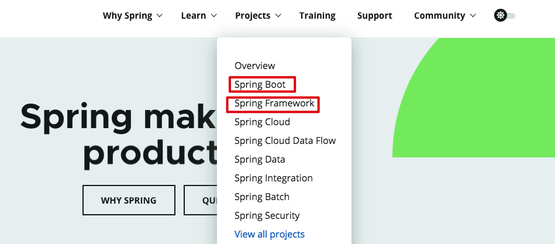

# Spring

Spring是一个很宽泛的概念，里面涉及到各种各样的产品（项目）。作为开发，最重要的就是学习`Spring Framework`和`Spring Boot`。



Spring里最核心的两个概念就是IOC容器和AOP，容器的作用减少你手动new对象，AOP面向切面编程增强了目标方法的功能。

问题？

* 其他框架是如何整合到Spring
* IOC有啥优势

## Spring快速入门

1.新建一个空的maven工程

2.导入Spring Framework的依赖包（导入spring-context会默认将core，bean，aop，expression也一并导入）

```xml
<dependency>
    <groupId>org.springframework</groupId>
    <artifactId>spring-context</artifactId>
    <version>4.3.9.RELEASE</version>
</dependency>
<dependency>
    <groupId>org.projectlombok</groupId>
    <artifactId>lombok</artifactId>
    <version>1.18.12</version>
</dependency>
```

3.在resource下新建一个spring-config.xml文件，该文件的作用就是定义IOC容器里的实例

```xml
<?xml version="1.0" encoding="UTF-8"?>
<beans xmlns="http://www.springframework.org/schema/beans"
       xmlns:xsi="http://www.w3.org/2001/XMLSchema-instance" xmlns:p="http://www.springframework.org/schema/p"
       xsi:schemaLocation="http://www.springframework.org/schema/beans
       http://www.springframework.org/schema/beans/spring-beans.xsd">

    <!--创建Car bean-->
    <bean id="car" class="com.zstu.bean.Car">
        <property name="carName" value="宝马"></property>
        <property name="color" value="white"></property>
        <property name="price" value="100000"></property>
    </bean>

    <!--创建Person bean-->
    <bean id="person" class="com.zstu.bean.Person">
        <property name="age" value="18"></property>
        <property name="name" value="ll"></property>
        <property name="gender" value="M"></property>
        <!--外部引用bean对象-->
        <property name="car" ref="car"></property>
        <!--内部创建bean对象，ioc容器是无法获取到该car01对象-->
        <!--<property name="car">-->
            <!--<bean id="car01" class="com.zstu.bean.Car">-->
                <!--<property name="carName" value="Nissan"></property>-->
                <!--<property name="color" value="white"></property>-->
                <!--<property name="price" value="2000"></property>-->
            <!--</bean>-->
        <!--</property>-->
        <property name="bookList">
            <list>
                <bean id="book001" class="com.zstu.bean.Book" p:bookName="西游记" p:author="吴承恩"></bean>
                <bean id="book002" class="com.zstu.bean.Book" p:bookName="三体" p:author="刘慈欣"></bean>
            </list>
        </property>

        <property name="map">
            <map>
                <entry key="爱好" value="唱歌"></entry>
                <entry key="性格" value="勇敢"></entry>
            </map>
        </property>
    </bean>
    
    <!--利用构造函数给属性赋值-->
    <bean id="person01" class="com.zstu.bean.Person">
        <constructor-arg name="name" value="ll"></constructor-arg>
        <constructor-arg name="age" value="20"></constructor-arg>
        <constructor-arg name="gender" value="F"></constructor-arg>
    </bean>

</beans>
```

4.新建com.zstu.bean包，在包里定义Person，Car和Book三个bean

Person.java

```java
package com.zstu.bean;

import lombok.Data;

import java.util.List;
import java.util.Map;

@Data
public class Person {
    private String name;
    private String age;
    private String gender;

    private Car car;

    private List<Book> bookList;

    private Map<String, String> map;

    public Person() {
    }

    public Person(String name, String age, String gender) {
        this.name = name;
        this.age = age;
        this.gender = gender;
    }
}
```

Car.java

```java
package com.zstu.bean;

import lombok.Data;

@Data
public class Car {
    private String carName;
    private String color;
    private Integer price;
}
```

Book.java

```java
package com.zstu.bean;

import lombok.Data;

@Data
public class Book {
    private String bookName;
    private String author;
}
```

5.在java目录下新建运行文件

```java
import com.zstu.bean.Person;
import org.springframework.context.ApplicationContext;
import org.springframework.context.support.ClassPathXmlApplicationContext;

public class Application {
    public static void main(String[] args) {
        ApplicationContext ctx = new ClassPathXmlApplicationContext("spring-config.xml");
        Person person = ctx.getBean("person", Person.class);
        System.out.println(person);
    }
}
```

6.运行

```
Person(name=ll, age=18, gender=M, car=Car(carName=宝马, color=white, price=100000), bookList=[Book(bookName=西游记, author=吴承恩), Book(bookName=三体, author=刘慈欣)], map={爱好=唱歌, 性格=勇敢})
```

除了上面手动指定注入的属性值外，我们还可以使用**自动装配**，自动装配的属性是在IOC容器里有的。

* autowire=byName：例如Person的属性有一个car，那么就会去IOC容器中找bean名称为car的对象来赋值
* autowire=byType：根据类型来自动注入

```xml
<bean id="person02" class="com.zstu.bean.Person" autowire="byName"></bean>
```

注意：

* spring创建对象默认调用的是无参构造方法
* spring对bean的属性进行赋值，利用的是setXxx方法，如果bean没有实现此方法，则会报错

### 注解方式

1.xml下配置扫描注解的标签

```xml
<?xml version="1.0" encoding="UTF-8"?>
<beans xmlns="http://www.springframework.org/schema/beans"
       xmlns:xsi="http://www.w3.org/2001/XMLSchema-instance"
       xmlns:context="http://www.springframework.org/schema/context"
       xsi:schemaLocation="http://www.springframework.org/schema/beans
        http://www.springframework.org/schema/beans/spring-beans.xsd http://www.springframework.org/schema/context http://www.springframework.org/schema/context/spring-context.xsd">

   <context:component-scan base-package="com.zstu"></context:component-scan>

</beans>
```

Spring在启动的时候，会根据base-package在该包中扫描所有的类，查找这些类是否有注解@Component，如果有则加入IOC容器

2.将需要放到IOC容器的类上加入@Component注解。如果需要依赖注入，使用@Autowired和@Value注解

Student.java

```java
package com.zstu.pojo;

import lombok.Data;
import org.springframework.beans.factory.annotation.Autowired;
import org.springframework.beans.factory.annotation.Value;
import org.springframework.stereotype.Component;

@Data
@Component
public class Student {
    @Value("15")
    private Integer age;

    @Value("zs")
    private String name;

    @Autowired
    private Teacher teacher;
}
```

Teacher.java

```java
package com.zstu.pojo;

import lombok.Data;
import org.springframework.stereotype.Component;

@Data
@Component
public class Teacher {
    private String name;
    private String course;
}
```

3.运行

```java
import com.zstu.pojo.Student;
import org.springframework.context.support.ClassPathXmlApplicationContext;

public class Application {
    public static void main(String[] args) {
        ClassPathXmlApplicationContext context = new ClassPathXmlApplicationContext("/applicationContext.xml");
        Student student = (Student) context.getBean("student");
        System.out.println(student.getTeacher());
        System.out.println(student.getAge());
        System.out.println(student.getName());
    }
}
```

## IOC和DI

控制反转IOC：将创建对象，赋属性值的方式进行翻转，从new，setXxx()翻转为了从SpringIOC容器getBean()

依赖注入DI：将属性值注入给了属性，将属性注入给了bean，将bean注入给了IOC容器

依赖怎么理解呢？

比如Student的属性teacher需要依赖Teacher对象

比如Controller层需要依赖Service层，Service层需要依赖Mapper层，注入的顺序肯定是mapper对象注入到Service层对象的属性，service层对象注入到controller层对象属性中

## 参考

[spring官方文档](https://docs.spring.io/spring/docs/4.3.9.RELEASE/spring-framework-reference/htmlsingle/)

